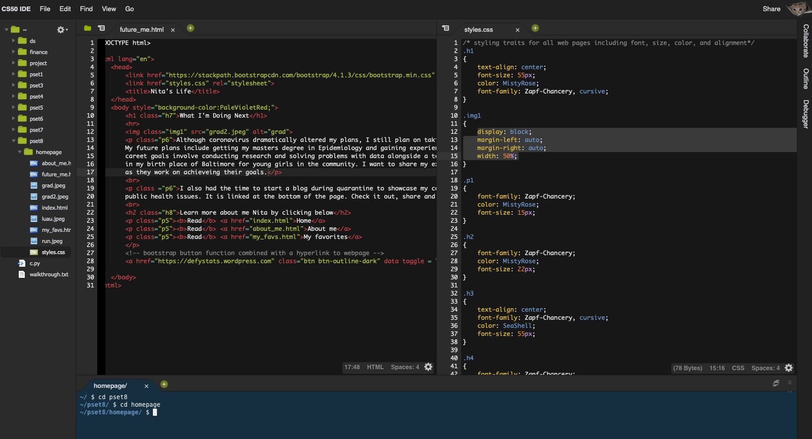

# Harvard-This is CS50x

## Introduction
Select projects from edx Harvard cs50 course (Introduction to Computer Science)

## Staring the Project

After enrolling in the course on edx, you can begin the course. You should take the time to read through the documentation 
and finding resources/online communities to help you through the projects. After you've set-up and read everything you can 
begin lecture 0 week 0. 

## Table of Contents
* [Technologies](#technologies)
* [Setup](#setup)
* [Further Resources](#further-resources)
* [Acknowledgments](#acknowledgments)

### Technologies
This project was created with:

* CS50 IDE
* Sublime Text
* 2020 Mac with 16GB running macOS Catalina Version 10.15.5

### Setup
1. Create an edx account at: https://courses.edx.org/register
2. Enroll in the Harvardx This is CS50x course on the website: https://www.edx.org/course/cs50s-introduction-to-computer-science
3. Begin the course making sure to read through all of the documentation and resources for help.

### Further Resources
Below are links to websites that will prove helpful when taking this course:

https://www.facebook.com/cs50/
https://www.facebook.com/groups/cs50/
https://www.quora.com/topic/CS50
https://stackoverflow.com/questions/tagged/cs50

### Acknowledgments
Thank you Harvardx, edx, David Malan, Doug Lloyd, Brian Yu, and all the other members who made this course possible. 

The skills learned in this course led to the creation of my own website: 
http://defystatistics.com 

